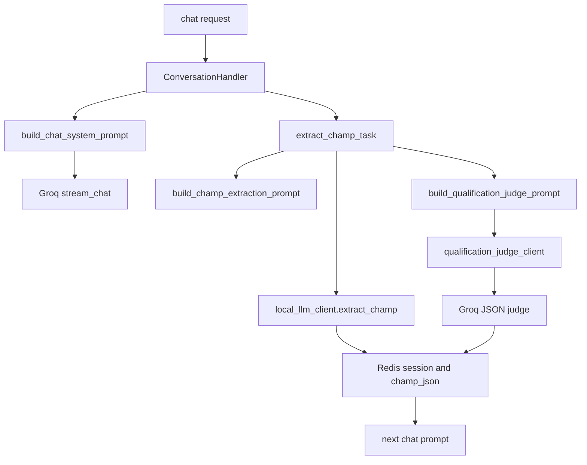

# Prompt Mimarisi

Bu dokuman, repodaki prompt katmaninin nerede tanimlandigini, runtime'da hangi dosyalarin gercekten kullanildigini ve hangi degisiklik icin hangi dosyanin hedeflenmesi gerektigini hizli gormek icin hazirlandi.

## Hizli Ozet

- Ana sohbet prompt'u tek basina template dosyasinda degil; `builder + template + runtime company_config + session state` birlikte uretiliyor.
- Kullaniciya giden ana sohbet metni `Groq` uzerinden akiyor.
- CHAMP extraction `local LLM`, qualification judge ise `Groq` uzerinden calisiyor.
- Extraction tarafinda artik tek kaynak `app/domain/conversation/prompts.py` icindeki `build_champ_extraction_prompt(...)`.

## Dosya Agaci

### Merkez builder dosyasi

- `app/domain/conversation/prompts.py`
  - `build_chat_system_prompt(...)`
  - `build_champ_extraction_prompt(...)`
  - `build_qualification_judge_prompt(...)`
  - `build_reasoning_report_prompt(...)`
  - `build_handoff_closing_prompt(...)`

### Template secimi

- `app/domain/conversation/templates/registry.py`
  - Dil ve sektor bazli `PromptTemplateSet` dondurur.

### Turkce prompt kaynaklari

- `app/domain/conversation/templates/tr/chat_system.py`
  - Kullaniciya giden ana sohbet davranisi
- `app/domain/conversation/templates/tr/extraction.py`
  - CHAMP extraction gorevi
- `app/domain/conversation/templates/tr/reasoning.py`
  - Handoff oncesi reasoning raporu
- `app/domain/conversation/templates/tr/closing.py`
  - Handoff kapanis metni
- `app/domain/conversation/templates/tr/qualification_judge.py`
  - Holistic judge prompt'u

### Few-shot kaynaklari

- `app/domain/conversation/few_shots/registry.py`
- `app/domain/conversation/few_shots/tr_construction.py`
- `app/domain/conversation/few_shots/tr_construction_judge.py`

### Runtime tuketicileri

- `app/application/conversation/handler.py`
  - Chat system prompt -> `Groq stream_chat`
- `app/application/scoring/champ_extractor.py`
  - CHAMP extraction prompt -> `local_llm_client.extract_champ`
- `app/infrastructure/llm/qualification_judge_client.py`
  - Judge prompt -> `Groq`
- `app/infrastructure/llm/local_llm_client.py`
  - CHAMP + reasoning
- `app/infrastructure/llm/groq_client.py`
  - Streaming chat + kapanis completion
- `app/infrastructure/llm/message_classifier.py`
  - Ayrik embedded classification prompt
- `app/infrastructure/llm/field_mapper.py`
  - Ayrik embedded field mapping prompt

## Runtime Akisi

## Hangi Degisiklik Nereyi Etkiler

### Sohbet tonu ve mesaj davranisi

Su dosyalari hedefle:

- `app/domain/conversation/templates/tr/chat_system.py`
- `app/domain/conversation/prompts.py`

Notlar:

- Template davranisin iskeletini belirler.
- `prompts.py` ise dinamik alanlari enjekte eder:
  - `champ_gap_instruction`
  - `kb_documents_content`
  - `faq_entries`
  - `forbidden_topics`
  - `custom_qualifying_questions`
  - `tone`
  - `custom_persona`

### CHAMP extraction

Su dosyalari hedefle:

- `app/domain/conversation/templates/tr/extraction.py`
- `app/domain/conversation/few_shots/tr_construction.py`
- `app/domain/conversation/prompts.py`

Notlar:

- Runtime'da extraction prompt builder artik merkezi olarak `build_champ_extraction_prompt(...)` uzerinden akiyor.
- JSON cikti beklentisi `app/infrastructure/llm/schemas.py` icindeki `CHAMPExtractionResult` ile uyumlu kalmali.

### Qualification judge

Su dosyalari hedefle:

- `app/domain/conversation/templates/tr/qualification_judge.py`
- `app/domain/conversation/few_shots/tr_construction_judge.py`
- `app/domain/conversation/prompts.py`
- `app/infrastructure/llm/qualification_judge_client.py`

Notlar:

- Judge sadece prompt metni degil, ayni zamanda cikti sozlesmesidir.
- JSON cikti `app/infrastructure/llm/schemas.py` icindeki `QualificationJudgmentResult` ile parse edilir.
- `recommended_next_question` sonraki chat turunda `champ_gap_instruction` icine dolayli olarak tasinabilir.

### Reasoning ve handoff

Su dosyalari hedefle:

- `app/domain/conversation/templates/tr/reasoning.py`
- `app/domain/conversation/templates/tr/closing.py`
- `app/application/qualification/handler.py`

## Dynamic Config Kaynaklari

Runtime'da prompt'u degistiren CRM kaynakli alanlar:

- `primary_language`
- `industry_focus`
- `tone`
- `custom_persona`
- `company_display_name`
- `working_hours`
- `pricing_hints`
- `faq_entries`
- `forbidden_topics`
- `custom_qualifying_questions`
- `ideal_customer_profile`
- `kb_documents_content`

Bu alanlar `app/application/conversation/handler.py` icinde CRM'den cekilir ve `prompts.py` builder'larina tasinir.

## Guvenli Degisiklik Rehberi

Bir promptu degistirmeden once su ayrimi yap:

1. Sadece kullaniciya gorunen sohbet tonu degisecekse:
   - `tr/chat_system.py` ve gerekirse `prompts.py`
2. Modelin JSON uretme sekli degisecekse:
   - ilgili template
   - `app/infrastructure/llm/schemas.py`
   - ilgili test dosyalari
3. Runtime hangi prompt builder'i cagiriyor sorusu varsa:
   - once `app/application/*` ve `app/infrastructure/llm/*` tuketicilerine bak

## Test ve Kontrat Noktalari

- `tests/unit/domain/test_prompts.py`
- `tests/unit/infrastructure/test_judge_client.py`

Prompt degisikliklerinde en cok kirilan noktalar:

- Dil bazli basliklarin yanlis prompta karismasi
- JSON alan adlarinin schema ile uyumsuz hale gelmesi
- Sohbet prompt'unda toplanan sinyallerin judge/extraction katmaniyla farkli yone gitmesi

## Mevcut Kararlar

- Turkce prompt oncelikli calisma dili olarak korunur.
- `custom_persona` artik chat template icinde aktif olarak kullanilir.
- Turkce chat prompt'una enjekte edilen dinamik bolumler Turkcelestirilir.
- Extraction runtime yolu merkezi builder'a baglanmistir; ayni mantigin iki farkli yerde drift etmesi azaltildi.
